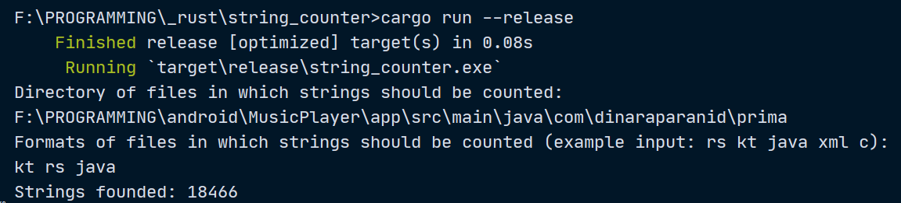

**Strings counter**
---------------

Simple script to count string of files in directory on Windows (and maybe other OS)

Usage
-----

1. Download [strings_counter.exe](strings_counter.exe) file on Windows or download the whole project in other OS.
2. If you' re using Windows, just click on downloaded file. If you're using other OS, just run the whole project ($ cargo run --release)
3. Follow the instructions as in example: 